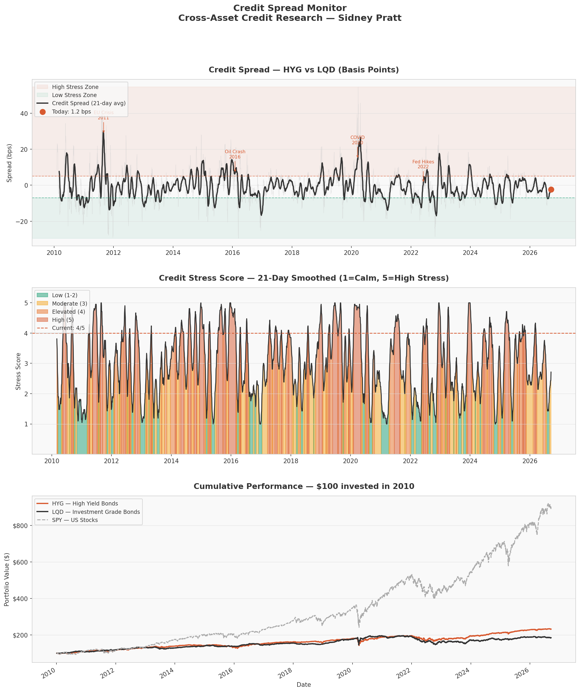

# Credit Spread Monitor
### Cross-Asset Credit Research | Sidney Pratt

## Overview
This model tracks the credit spread between High Yield bonds (HYG) 
and Investment Grade bonds (LQD) to detect building stress in credit 
markets. The spread is converted into a stress score from 1 to 5 and 
monitored daily using 16 years of real market data from 2010 to 2026.

## Methodology
- **Data:** 16 years of daily price data (2010–2026)
- **Assets:** HYG (High Yield), LQD (Investment Grade), SPY (Stocks)
- **Signal:** 21-day rolling return difference between LQD and HYG
- **Stress Score:** 1 (Very Calm) to 5 (High Stress)
- **Historical context:** Percentile rank vs all readings since 2010

## Current Reading (September 17, 2026)

| Metric | Value |
|--------|-------|
| Credit Spread | 1.2 basis points |
| Stress Score | 4 out of 5 |
| Status | ELEVATED |
| Percentile Rank | Higher than 63% of all readings since 2010 |

## Stress Scale

| Score | Status | Meaning |
|-------|--------|---------|
| 1 | Very Calm | Credit markets extremely relaxed |
| 2 | Calm | Normal market conditions |
| 3 | Moderate | Some caution warranted |
| 4 | Elevated | Credit stress building |
| 5 | High Stress | Significant credit risk detected |

## Key Stress Periods Detected (2010–2026)
- **2011** — European Sovereign Debt Crisis
- **2016** — Oil Price Crash & China Slowdown
- **2020** — COVID-19 Pandemic Crash — largest spike on record
- **2022** — Federal Reserve Rate Hike Cycle
- **2026** — Current Elevated Stress Period

## Combined Signal
When combined with the Multi-Asset Regime Detector:

| Model | Signal |
|-------|--------|
| Regime Detector | RISK-ON (but cautious) |
| Credit Monitor | ELEVATED stress (4/5) |
| Gold Signal | Outperforming (+2.58%) |

**Conclusion:** Two independent AI models flagging elevated caution 
simultaneously. Markets appear calm on the surface but credit and 
gold signals suggest building stress underneath.

## Tools & Technologies
- **Python** — core programming language
- **scikit-learn** — stress score calculation
- **pandas / numpy** — data manipulation
- **yfinance** — market data
- **matplotlib** — visualization
- **Google Colab** — development environment

## Performance Charts

## Author
Sidney Pratt | Cross-Asset Credit Research  
github.com/sidneyppratt-svg/credit-spread-monitor
